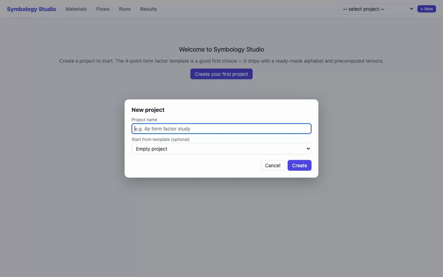
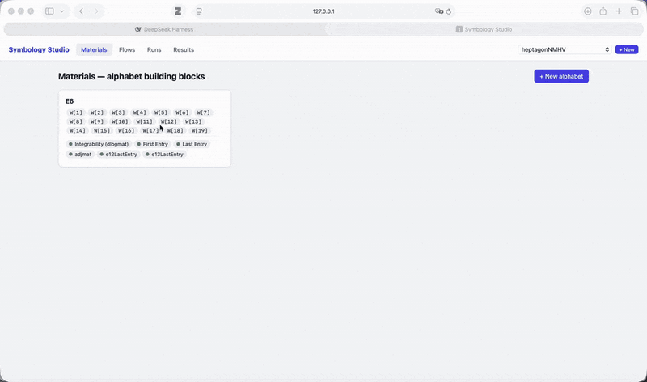
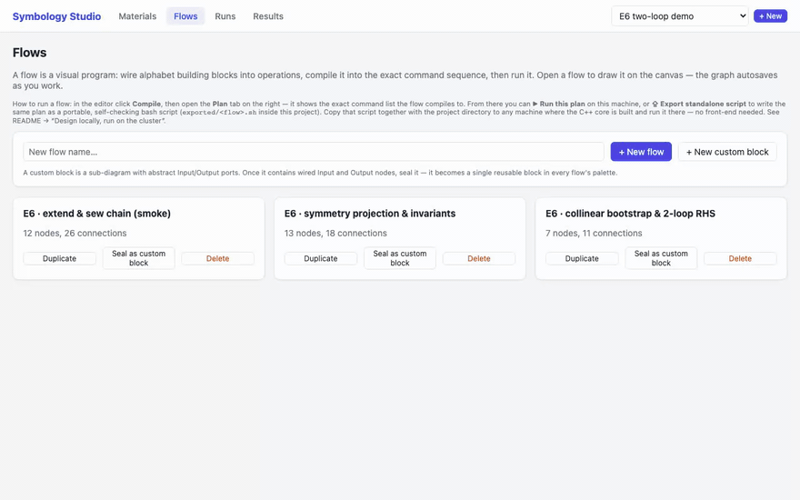
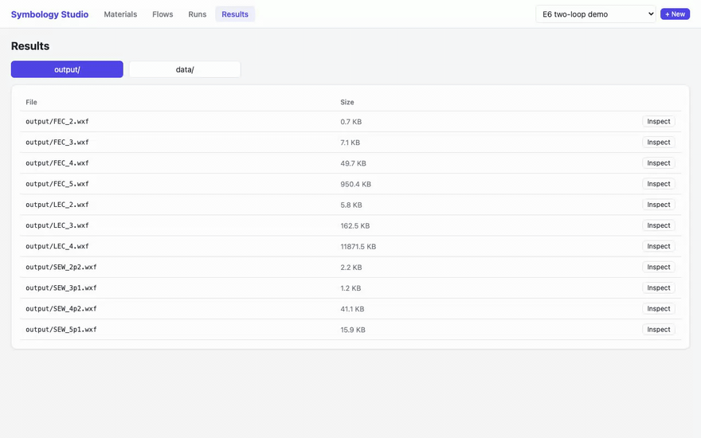
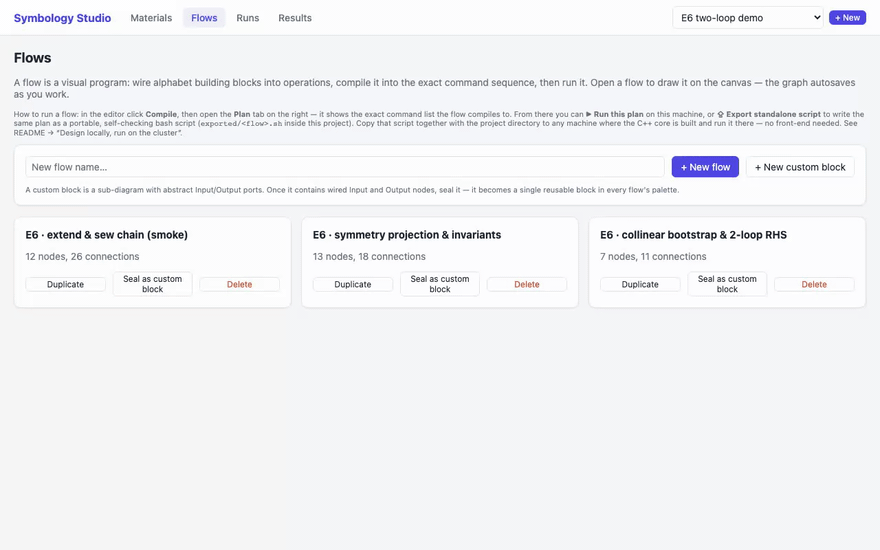

# Symbology Studio — September 2026 update

Welcome to the September 2026 update of Symbology Studio. This release
completes the editor's core loop — start from an example, compile a flow,
run it with verification, inspect the exact tensors, and carry the whole
computation to a cluster — and hardens every part of it in a ground-up
robustness pass. The update closes with a big thank-you to the outside
audit that drove it.

> Prefer step-by-step instructions with the same demos? See the
> [illustrated front-end guide](../front-end-guide.md).

## Highlights

- **Start from a built-in example** — templates now ship with certified
  example flows and precomputed tensors. [→](#projects-and-materials)
- **Runs you can trust** — every step executes in an isolated attempt,
  and results publish only after validation. [→](#the-flow-editor)
- **Inspect any tensor** — dimensions, nnz, and sample entries straight
  from the browser. [→](#results)
- **Design locally, run on the cluster** — a standalone script that
  embeds the same verification and caching as the editor. [→](#design-locally-run-on-the-cluster)
- **17 notable fixes** — from contradiction-preserving condition export
  to recoverable unsaved edits. [→](#notable-fixes)

## Projects and Materials

**Start from a built-in example.** The New Project dialog offers a
4-point form factor project with a ready-made 93-letter alphabet, the
pentagon and E6 bootstrap examples, or an empty project. Templates copy
their seed tensors into the project, so the example flows are runnable
the moment the project exists.

**Materials is the project's library.** Alphabets live here with their
letters, computed properties (integrability, first/last entry, symmetry
transformations), and tensors. Properties show a **Compute** action while
pending; everything else in the app — flows, runs, results, export —
reads from this page.

**Edit an alphabet and everything downstream knows.** Changing an
alphabet's definition marks its dependent properties stale: computable
properties must be regenerated, precomputed ones must be replaced, and
compilation refuses to quietly reuse a tensor that describes the old
definition.

## The flow editor

**A real research flow in the editor.** The tour below walks
**NMHVw4flow**, a production research flow from the heptagon project:
selecting a node opens its inspector on the right, and the canvas pans
and zooms across graphs with dozens of nodes.

**Compile before you run.** The **Compile** button validates the graph
(unique node ids, connected ports, single source per input) and renders
the concrete step list in the Plan panel — each step names the binary it
will invoke and every output it must produce. A step that exits zero
without producing its declared outputs fails the run; "it printed no
error" is not success.

**Runs you can trust.** Each step executes in an isolated attempt
directory: inputs are snapshotted, outputs are verified non-empty,
inputs that changed mid-step abort publication, and validated files
replace the old ones atomically with rollback. A step is skipped only
when its outputs **and** a SHA-256 fingerprint of every input — including
the binaries — still match, so editing anything upstream recomputes
exactly the affected chain.

**Live logs that survive reconnects.** The run page streams step events
and full logs with numbered events and a reconnect cursor; a dropped
connection resumes where it left off, and older events always remain in
the saved `runs/<id>.log`. Finished runs survive server restarts, and
records interrupted by a restart are marked failed instead of hanging in
"running" forever.

**One run per project.** A second run on the same project is refused
with a clear message instead of racing on output files. The same lock
covers exported scripts, so a cluster script and the editor cannot
corrupt each other's caches on the same machine.

## Results

**Inspect any tensor.** The Results page lists every tensor in
`output/` and `data/` with its size; **Inspect** loads dimensions,
non-zero count, and a sample of entries. It is the quickest sanity check
before building on a tensor — the recording shows the E6 `FEC_2` seed
inspecting to `28 × 7 × 42` with 91 non-zero entries.

## Design locally, run on the cluster

**Standalone scripts with the editor's guarantees.** **⇪ Export
standalone script** writes `exported/<flow>.sh` — a Bash script that
embeds the exact staging, fingerprinting and verification code the local
runner uses, with the compiled plan as data rather than shell code. It
needs Bash and Python (no front-end dependencies, no Mathematica when
the Wolfram-dependent tensors are already in the project), accepts
paths with spaces and apostrophes, and relocates cleanly after you copy
the project directory to another machine.

**Script settings.** Environment variables control a run:

| Setting | Behavior |
|---|---|
| `SYMBOLOGY_ROOT` | Repository with the built C++ core. |
| `PROJ_DIR` | Project directory (defaults to the script's `..`). |
| `STEPS` | Run a subset, e.g. `3,5-9`. |
| `STEP_TIMEOUT` | Per-step watchdog in seconds (`0` = off). |
| `WOLFRAM_MODE` | `auto`/`skip`/`fail` — how Wolfram steps behave when Mathematica is absent; content digests must still match. |
| `PYTHON` / `WOLFRAMSCRIPT` | Override those executables. |

## Notable fixes

1. **Contradictions survive condition export.** An inconsistent system
   (`0 = nonzero`) exported and reimported as solvable no longer can:
   contradictory rows are preserved through export, and reimport fails.
2. **Cached results are content-checked.** Truncated or damaged outputs,
   changed inputs inside data directories, and rebuilt binaries all
   invalidate the cache now — file existence alone proves nothing.
3. **The FEC chain resumes correctly.** Advancing from two to three
   loops over a partially cached directory no longer extends from a
   stale predecessor tensor.
4. **Malformed WXF can't crash the readers.** The WXF decoder is
   bounds-checked end to end; seventeen previously crashing malformed
   inputs now produce readable errors, verified with sanitizer builds
   and a mutation corpus.
5. **Unsaved edits are recoverable.** Autosave is serialized per flow,
   saves are revision-checked (a stale tab gets HTTP 409, not a
   overwrite), pending edits survive navigation in session storage, and
   a failed save offers **Download draft** / **Reload saved flow**.
6. **One error report per error.** A failed network request can no
   longer recurse the error reporter twenty-one times.
7. **The symmetry wrapper is mathematically correct.** Appended-column
   pivots are no longer mistaken for proofs that a transformation does
   not exist, and empty invariant spaces produce valid zero-row tensors.
8. **The shipped examples are certified.** Pentagon and 4p form factor
   flows now solve their conditions on the unrestricted word basis
   before imposing symmetry — 76 and 689 independent invariant symbols,
   each certified complete by an independent modular rank calculation.
9. **Numeric inputs are parsed strictly.** `2junk`, `1.5`, `1/0` and
   friends are rejected with an error instead of silently meaning `2`,
   `1`, or `0`.

…plus graph validation on save, startup reconciliation of interrupted
runs, per-port connection checks, Windows device-name-safe project
names, narrow-screen layouts, and a Windows launcher that reports
failures instead of vanishing.

## Engineering

- The public regression suites (`make check-public`) run in CI on a
  pinned FLINT 3 / GCC 14 toolchain, with an AddressSanitizer job for
  the WXF readers and a native-Windows editor job.
- The server runs on stock Python 3.9 again (macOS's default), and CI
  enforces the 3.9 floor on every push.
- The full audit trail is published as documentation in
  [docs/](../README.md), and the CRC32 baselines moved next to the
  regression tooling in `tests/baselines/`.

## Thank you

This release was shaped by an external robustness audit — thirteen
findings, four of them rated critical, each with a reproduction and a
regression test in `tests/`. The audit reports are archived in
[docs/](../README.md). Thank you for making the product better.
